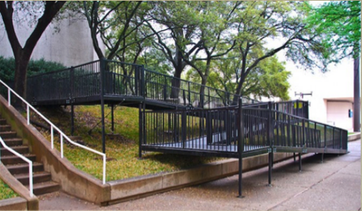

# Universal Design for Learning: The Why, What and Where 

Presenters:   
- Moira Fricke, M.A., Trinity Western University  
- Ruby L. Owiny, Ph.D., Trinity International University   

## Poll 

1. How much do you know about UDL?
    - A little
    - A lot
    - None
2. How much have you incorporated UDL principles into the design of your courses?
    - A little
    - A lot
    - None
3. Do you agree or disagree with the following quote?  

> “A mind is a fire to be kindled, not a vessel to be filled.  If a child (student) can’t learn the way we teach, maybe we should teach the way they can learn”. ~ Ignacio ‘Nacho’ Estrada

## Why should we care about UDL?

<iframe width="560" height="315" src="https://www.youtube.com/embed/4FE1CLS7i3k" title="YouTube video player" frameborder="0" allow="accelerometer; autoplay; clipboard-write; encrypted-media; gyroscope; picture-in-picture" allowfullscreen></iframe>

## TWU Context

| Age of Undergrad Students | Number |
| :---: | :---: |
| Under 18 | 86 |
| 18-24 | 2023 |
| 25+ | 337 |

| Percentage of Indigenous Students | Percent |
| :---: | :---: |
| Undergrad | <1% |
| Graduate | <1% |

| Percentage of International Students | Percent |
| :---: | :---: |
| Undergrad | 45% |
| Graduate | 75% |

```{block, type='wp'}
#### Breakthrough Room Questions
1. What concerns do you have for your students?  
2. What challenges do your students face (e.g., disability, single-parents, working a lot, etc.)? 

```

## Session Objectives

As a result of this presentation, participants will be able to: 
- Define UDL  
- Describe the characteristics of UDL  
- Explain the research supporting the implementation of UDL  
- Consider the UDL framework when planning & implementing instruction  

## What is UDL?

Since 1984, [CAST](https://www.cast.org/) has sought to explore how to help learners across ages and settings to achieve high standards. 

UDL was founded on that effort.

Continued growth: Rising to Equity Initiative  


```{block, type='reflect'}
## Image Contents

### Learn with us. Research with us. Change the world with us.{-} 
> Universal Design for Learning is ont of the few big and truly transformative ideas to emerge in education over the past two decades. ~Martha L. Minow, Former Harvard Law School dean and author of *Just Schools: Pursuing Equality in Societies of Difference

Partners include:
- PreK-12 stakeholders  
- Higher education  
- workforce  
- Tech and publishing industries  
- Government agencies  
- Nonprofits   
- Foundations and donors  
- Advocacy Organizations  

#### Our Core Lever of Change {-}
We pioneered Universal Design for Learning (UDL), a research-based framework that guides educator and others as they provide rich instructional supports, reduce unnecessary barriers to learning, and help all individuals become expert learners.

#### Applied Research {-}
CAST investigates solutions to the most critical questions across preK-12, higher ed, and workforce, including questions related to equity, access, and outcomes.

#### Design and Development {-}
Building on an award winning history, CAST co-designs transformative solutions, improvement strategies, and tools for learning.

#### Building Knowledge, Skills, and Community {-}
CAST offers professional learning convenings, technical assistance, practical resources, and online platforms that support UDL implementation.

Website: [cast.org](https://cast.org)  
Professional Learning Opportunities: [castpl.org](https://castpl.org/)  
Books and Media: [castpublishing.org](https://castpublishing.org/)  
Email: [cast@cast.org](mailto:cast@cast.org)  
Phone: 781-245-2212  
200 Harvard Mill Square, Suite 210  
Wakefield, MA 01880

```

## Paradigm Shift

UDL is a shift in how we ***think*** about students, curriculum and instruction. Instead of attempting to fix the ***student***, we fix ***curriculum and instruction.***

> Consider the needs of the broadest possible range of users from the beginning. ~Architect, Ron Mace

Consider the following images:



## A Path for Everyone


Photo Credit: Michael F. Giangreco and Kevin Ruelle.

## Adjustable car seats

Do you use the features in your car to adjust the height, angle, and distance from the steering wheel?

What if you couldn't do that? How comfortable would you be driving? how safe would you be?

## Universal Design for Learning in Higher education

<iframe width="560" height="315" src="https://www.youtube.com/embed/VwA8cQ2xA9o" title="YouTube video player" frameborder="0" allow="accelerometer; autoplay; clipboard-write; encrypted-media; gyroscope; picture-in-picture" allowfullscreen></iframe>

## Where did UDL come from?

### Learner Variability


- Three different fMRI brain activity patterns showing different people performing the same finger-tapping task.
- Colour represents levels of brain activity during performance
    - Blue = low to moderate activity
    - Red = high activity
    - Yellow = extremely high activity

### Brain Networks

- two types of brain research form the basis
    - `learner variability` - no two people learn in exactly the same way
    - `brain networks` - three different networks in our brains, each of which need to be engaged for high-quality learning

The UDL framework provides instructors with tools to make sure all three networks are engaged with all learners. 

### UDL Premise

 To provide equitable opportunities to reach high standards across a variety of students.

 

