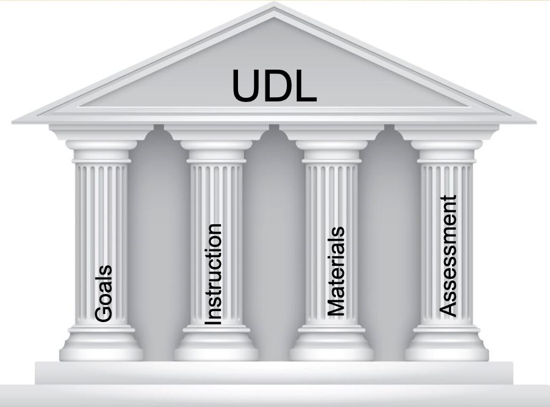
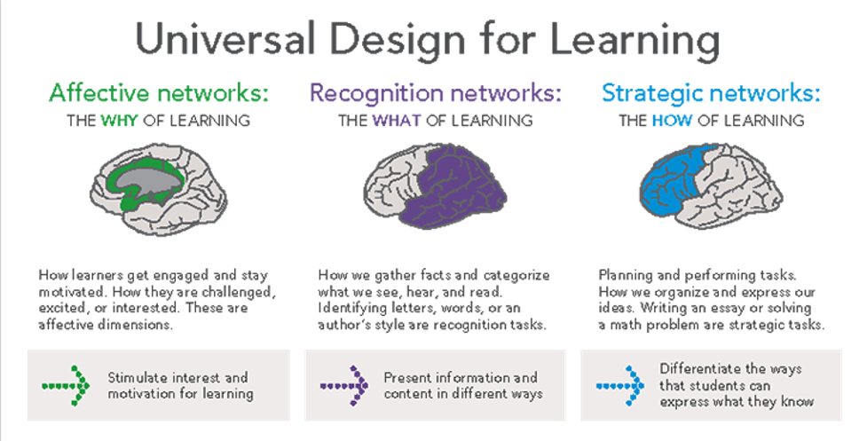
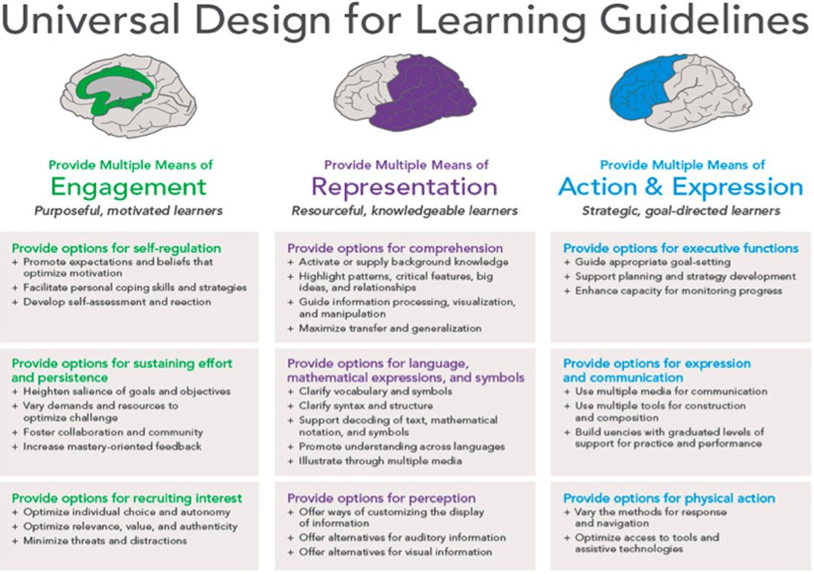

# Unpacking the Principles, Discovering the Joy 

Presenters:

- David Stinson, M.A., Trinity Western University  
- Moira Fricke, M.A., Trinity Western University  

## Designing Cars {-}

What do you want to use it for?


## ~~Universal~~ Great Design {-}

Great design involves prioritizing goals and making good choices that lead toward those goals.

In the context of learning, that means prioritizing your learning objectives (what learners will know or be able to do after the successful completion of the course or learning activity), and making specific design choices that will allow you to not only get 'there', but also to know when your learners have arrived.

> The goal of UDL is to design learning experiences for many users with diverse abilities.

## Renovations {-}

If you have ever renovated a house, you know that there are some steps you go through in the process.

|   |   |
|:---:|:---:|
| Trigger  | Design Well|
|Plan | Figure out the logistics |
| Cost/Reward | Be realistic|

> Great Design is rarely seen.

> Bad design is experienced on a regular basis.


<!---
There is some sort of `trigger` that causes you to `explore` the possibility of upending your life for months on end. This is followed by a process of `prioritizing` what you want to renovate, then engaging in a `cost` analysis of your priorities, and possibly revising your priorities. Then you start making a specific `plan`, which you then `execute`, triggering innumerable `unexpected` barriers on your way to the end of the project, at which time, you `evaluate` the whole thing.

- trigger
- exploration
- prioritization
- Cost
- plan 
- execute
- unexpected
- evaluate

--->

## Moira's Experience {-}

> As a new TWU instructor, I will share my humble attempts to incorporate some UDL principles into my 3rd and 4th year Education courses. My sincere hope is this may inspire you to look at your own courses and see where they can bloom.

### The Four Curricular Pillars of UDL {-}



### Brain Networks {-}



### UDL Learning Guidelines {-}



```{block, type='reflect'}
#### *Mea culpa*
We do realize that the images above are not accessible. It is not good to include a large amount of text in an image because screen-readers will not be able to render it. Additionally, the text on these screenshots is far too small. 
```

### Why Care? {-}
Affective dimensions of learning...

- Recruit student interest
- Grab their attention
- Generate excitement
- Provide motivation

### What do I know? {-}

Present information, ideas, and content in different ways to maximize understanding:
- Video
- Audio
- Graphics
- Tactile objects 
- Accessible online text

### How students can 'Show what they know'? {-}

Provide multiple ways that students can demonstrate their knowledge. Give students ***voice*** and ***choice***.
- Visual arts
- Podcasts
- Debates
- Multi-media
- Comics
- Oral presentations

### Want to know more? {-}

[CAST.org](https://cast.org)
- CAST Virtual Summit -> March 30 - April 1, 2022
- Courses
- Resources
- Collaboration with other higher education instructors.
