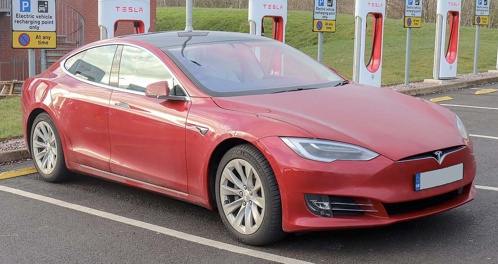

# Unpacking the Principles, Discovering the Joy 

Presenters:

- David Stinson, M.A., Trinity Western University  
- Moira Fricke, M.A., Trinity Western University  

## Cars {-}

What do you want to use it for?

## ~~Universal~~ Great Design {-}

Great design involves prioritizing goals and making good choices that lead toward those goals.

In the context of learning, that means prioritizing your learning objectives (what learners will know or be able to do after the successful completion of the course or learning activity), and making specific design choices that will allow you to not only get 'there', but also to know when your learners have arrived.

## Renovations {-}

If you have ever renovated a house, you know that there are some steps you go through in the process.

There is some sort of `trigger` that causes you to `explore` the possibility of upending your life for months on end. This is followed by a process of `prioritizing` what you want to renovate, then engaging in a `cost` analysis of your priorities, and possibly revising your priorities. Then you start making a specific `plan`, which you then `execute`, triggering innumerable `unexpected` barriers on your way to the end of the project, at which time, you `evaluate` the whole thing.

- trigger
- exploration
- prioritization
- Cost
- plan 
- execute
- unexpected
- evaluate

